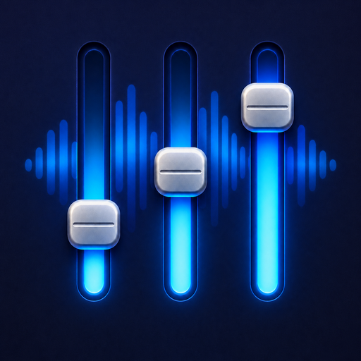

<p align="center">
  
</p>

<h1 align="center">dBDeck</h1>

<p align="center"><a href="README.zh-CN.md">简体中文</a></p>

dBDeck is a lightweight per-app volume controller for the macOS menu bar. It supports macOS 14.2 and later.

## Features

- Adjust each app from 0% to 200% without changing the system volume.
- Put apps in a useful order so the control you need is easy to find.
- Carefully optimized to avoid additional energy use in most situations.

## Privacy and permissions

dBDeck does not record, store, or transmit audio. It has no networking feature. Audio processing stays on the Mac.

The app stores the following data locally:

- App identifier, display name, and last known app path.
- Accumulated playback seconds and the most recent playback date.
- Per-app volume and mute state.
- Which dormant records are hidden and when list maintenance last ran.

## Requirements

- macOS 14.2 or later.

## Install and first launch

1. Download the DMG for your Mac from the Releases page: `arm64` for Apple silicon, `x86_64` for Intel. If you are unsure, check  > About This Mac.
2. Open the DMG and drag dBDeck into the Applications folder.
3. Launch dBDeck. Its icon appears in the menu bar at the top of the screen, rather than in the Dock at the bottom.
4. When macOS requests System Audio Recording permission, grant it so dBDeck can adjust individual apps. Restart dBDeck if macOS asks you to.

### Opening the current unnotarized build

The current build is not Developer ID signed or notarized. Only override macOS security after downloading dBDeck from this repository and verifying its checksum. Do not disable Gatekeeper globally.

Using the graphical interface:

1. Try to open dBDeck once, then dismiss the macOS warning.
2. Open **System Settings → Privacy & Security** and scroll down to Security.
3. Click **Open Anyway**, authenticate, then confirm **Open**. macOS saves an exception for this app only.

Alternatively, after copying dBDeck to Applications, remove quarantine from this app only and launch it from Terminal:

```sh
xattr -dr com.apple.quarantine "/Applications/dBDeck.app"
open "/Applications/dBDeck.app"
```

## Build and run

Building from source requires Xcode 16 or a compatible Swift 6 toolchain.

```sh
./script/build_and_run.sh
```

The script builds `dist/dBDeck.app`, applies an ad-hoc signature for local development, and launches it. Use the packaging script below to create a release DMG.

Optional modes:

```sh
./script/build_and_run.sh --verify
./script/build_and_run.sh --logs
./script/build_and_run.sh --debug
```

Create the release DMGs and checksums, one per architecture:

```sh
./script/package_dmg.sh 0.2.2
```

Each build targets a single architecture, so a download carries only the code the Mac it lands on can run. The artifacts are written to:

- `dist/dBDeck-0.2.2-arm64.dmg` and `dist/dBDeck-0.2.2-arm64.dmg.sha256`
- `dist/dBDeck-0.2.2-x86_64.dmg` and `dist/dBDeck-0.2.2-x86_64.dmg.sha256`

## Current scope

The current version follows the system's default output device. Per-app output device routing, automatic ducking, profiles, EQ, global shortcuts, CLI, Shortcuts, and Raycast integration are not included.

## Contributing

Bug reports and focused pull requests are welcome. Please run `./script/test.sh` before submitting a code change.

## License

dBDeck is licensed under the [Apache License 2.0](LICENSE) (`Apache-2.0`).
